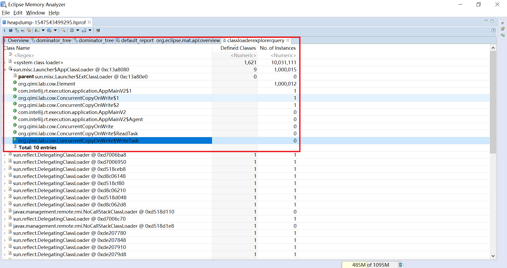

## 分析类加载器(Analyze Class Loader)

类加载器将类加载到虚拟机的内存中，分析堆转储文件时，类加载器的分析也很重要：
* 应用通常会使用单独的类加载器加载自己的组件
* 加载的类通常会存储在一个独立的内存空间-永久代中，永久代同样可以耗尽，导致内存溢出

### 类加载管理器
通过 Open Query Browser > Java Basics > Class Loader Explorer 可以打开类加载管理器。如下图

在遵守OSGi的场景，MAT为每个类加载器都附加了一个有意义的标签。和普通的JVM程序相比，OSGi的程序天生拥有动态模块的特点，
不同的模块(OSGi里称之为Bundle)有着独立的生命周期，可以独立进行安装、启动、停止、卸载的操作，模块间的依赖性管理也由OSGi提供

这个表格中各列的含义：
* Class Name: 类加载器名，格式是类加载器+地址，如果类加载器前显示parent，含义是父加载器。展开后是通过这个类加载器加载的类名。
* Defined Classes: 加载的类数量
* No. of instances: 存活的对象实例数量
如果相同的组件被重复加载多次，可以通过No. of instances列观察哪个类加载器更加活跃，哪个类加载器应该被回收

