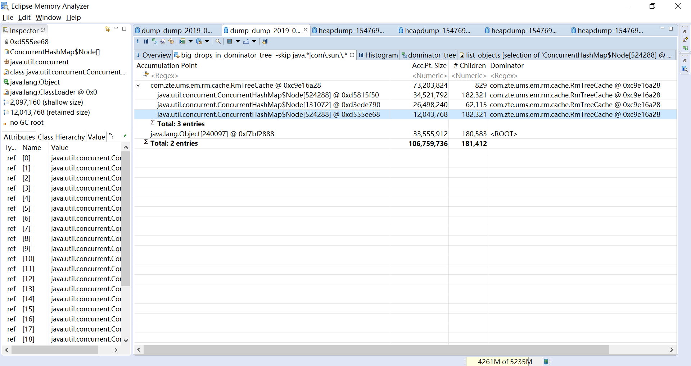

## 支配树上的重枝 (Big Drops in Dominator Tree)

通过这个功能可以观察到转储的支配树上的内存积聚点，会显示父亲和孩子的保留堆大小相差最大的对象。
一个对象下积聚了很多个小对象的内存占用也可以在这个功能中观察到。

这是在内存溢出时辅助观察的一个手段，一般情况下重枝会和支配树功能展示出一致的问题

表格中字段的含义
* Acc.Pt.Size: 应该就是这个对象精确的保留堆大小
* Children: 对象在支配树上孩子的数量
* Dominator: 支配者，也就是父亲对象
* Dom.Retained Size: 支配者的保留堆大小

