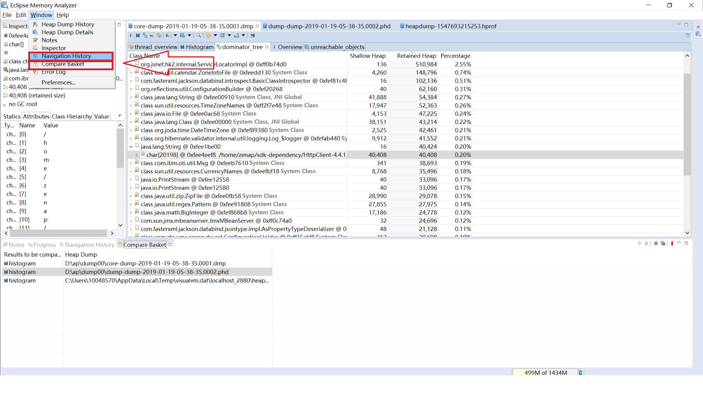
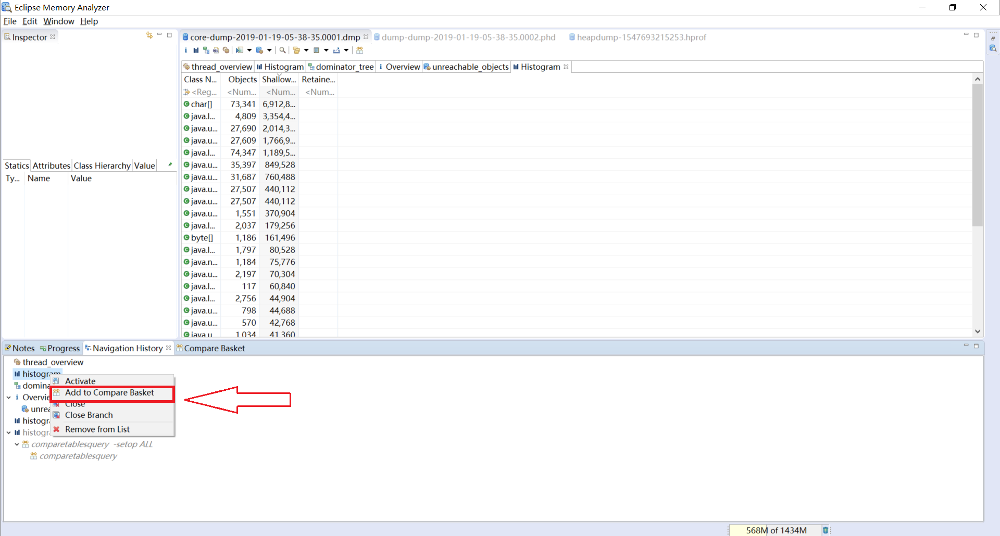

## 比较池(Compare Basket)

可以使用MAT比较多个转储文件中的直方图、支配树、线程等等，通过相同功能在多个转储中的输出，更有利于推演内存的变化情况

使用方法（以直方图为例）

1. 通过Window > Navigation History，打开历史导航面板(Navigation History会按用户操作的顺序，显示功能列表，功能可能会重复出现)，
通过Window > Compare Basket，打开比较池面板，如图1

2. 打开每个转储文件的直方图
3. 切换到每个转储文件，在导航历史面板中选择直方图，右键选择Add to Compare Basket，如图2

4. 在比较池面板中点击Compare the Results（视图右上角的红色"!"图标），如图3

5. 显示比较结果
