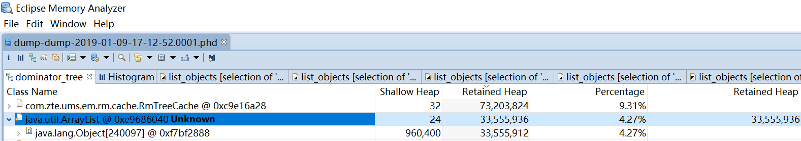

## 支配树(Dominator Tree)

支配树在[这里](../../概念/README.md)有详细介绍，MAT可以将对象图结构转换为一种支配树结构，通过这种结构就可以计算出某个对象的内存占比

MAT的直方图(Histogram)是从类的角度看内存占用情况，支配树(Dominator Tree)是从对象的角度看内存占用情况

可以在按包、按类加载器、按父类来显示表格，如下图

这个显示就相对直方图就有用多了，从对象角度看，肯定是应用的对象占据最大的内存，例如上图中的org.*包

表格每个字段的含义
* Class Name:类名，包含了大量的信息，[这里](../README.md)有详细介绍
* Shallow Heap:浅堆占用内存，[这里](../../概念/README.md)有详细介绍，准确值
* Retained Heap:保留堆占用内存，[这里](../../概念/README.md)有详细介绍，准确值？
* Percentage:占用内存大小的百分比，准确值
* 可以使用右键功能Calculate Precise Retained Size计算精确值，会增加一个Retained Heap列，从
实际情况看，两个Retained Heap列的值一样

可以按任意列排序，常用排序是Retained Heap、Percentage列

[Dominator](https://github.com/wenger66/java-lab/tree/master/dominator) 是一个观察支配树的实验

通过MAT的支配树功能(图2)，就能看到(图3)的从基于引用的对象图到基于支配的支配树结构

