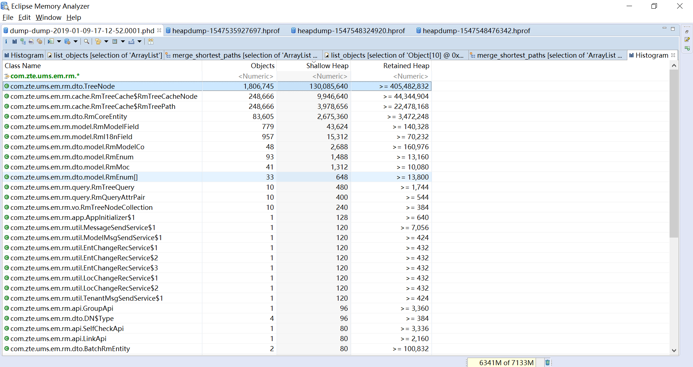
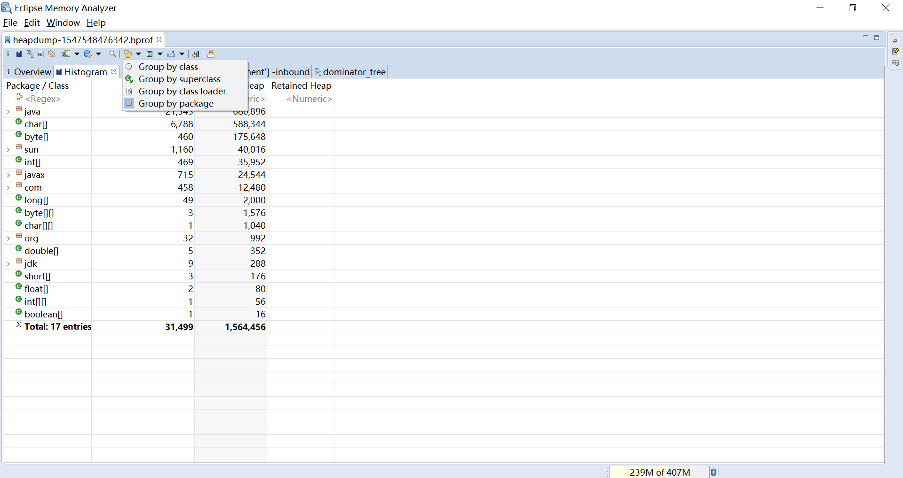

## 直方图(Histrogram)

MAT的直方图(Histogram)是从类的角度看内存占用情况，支配树(Dominator Tree)是从对象的角度看内存占用情况

直方图的主要作用是查看实例的个数，尤其是自己创建的类的实例个数

按应用的类查看，输入com.zte.ums.em.rm.*，如下图

也可以在按包、按类加载器、按父类来显示表格，如下图

不过我个人感觉直方图中按包显示用处不大，占用内存最多的肯定是java.*的包或者char[]、byte[]数组等

表格每个字段的含义
* Class Name:类名，包含了大量的信息，[这里](../README.md)有详细介绍
* Objects:实例个数，准确值
* Shallow Heap:浅堆占用内存，[这里](../../概念/README.md)有详细介绍，准确值
* Retained Heap:初始为最小保留堆占用内存，保留堆占用内存大于等于该值。可以使用右键功能Calculate Precise Retained Size计算精确值
[这里](../../概念/README.md)有详细介绍

可以按任意列排序，常用排序是Objects和Retained Heap列

