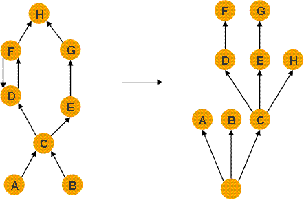

## 直接支配者(Immediate Dominators)
直接支配者是支配树中的概念，[这里](../README.md)有详细介绍

通过某个对象右键Immediate Dominators，可以查看某个对象的直接支配者，如下图

[Dominator](https://github.com/wenger66/java-lab/tree/master/dominator) 是一个观察支配树的实验

通过MAT的支配树功能，就能看到(下图)的从基于引用的对象图到基于支配的支配树结构

那么H的直接支配者就是C，通过Immediate Dominators也是相同的结论，如下图
[Immediate Dominators](./3.png)