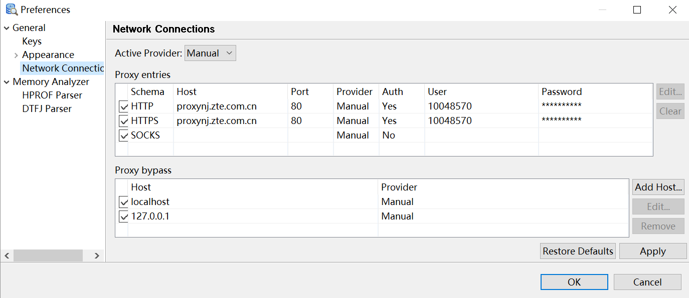
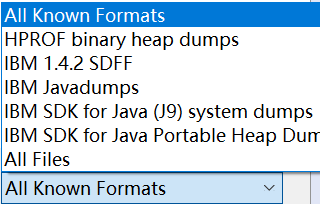

## 安装DTFJ插件

### PHD
OpenJ9的Heap Dump的格式是PHD，即Portable Heap Dump，称为便携式堆转储，大约是20%的堆大小。

HotSpot的Heap Dump的格式是HPROF，在OpenJ9中也称为经典(Classic)堆转储文件

|转储文件格式	| 近似磁盘大小	对象、类和类加载器	| 线程信息	| 域名称	| 域和数据引用| 基本域	| 基本数组内容	| 精确的垃圾收集源	| 原生内存和线程| 
| --------   | -----| -----| -----| -----| -----| -----| -----| -----:   | 
|IBM PHD	|20 % 的 Java 堆大小|	Y	|具有 Javacore*|	N	|Y	|N	|N	|N|	N|
|HPROF	|Java 堆大小|	Y|	|Y	|Y	|Y	|Y	|Y	|Y	|N|
|IBM SYSTEM DUMP|	Java 堆大小 + 30%	|Y	|Y	|Y	|Y	|Y	|Y|	Y	|Y|

### DTFJ

DTFJ即 IBM Diagnostic Tool Framework for Java.

MAT只能读取经典格式的转储，只有安装了DTFJ插件，才能读取PHD格式的转储

### 安装

1. 选择Window > Preferences...
设置代理服务器，如下图

2.  选择Help > Install New Software...
   出现对话框

3. 在Work with里输入http://public.dhe.ibm.com/ibmdl/export/pub/software/websphere/runtimes/tools/dtfj/
   出现了DTFJ插件的选择
   
选择IBM Monitoring and Diagnostic Tools > Diagnostic Tool Framework for Java，然后一直下一步下一步就可以了

安装完插件重启MAT，在File > Open Heap Dump的可选的文件格式中可以打开的转储文件格式

