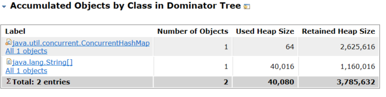

## 内存泄漏分析(Leak Suspects)

 MAT 工具提供了一个很贴心的功能，将报告的内容压缩打包到一个 zip 文件，并把它存放到原始堆转储文件的存放目录下，这样如果您需要和同事一起分析这个内存问题的话，
 只需要把这个小小的 zip 包发给他就可以了，不需要把整个堆文件发给他。并且整个报告是一个 HTML 格式的文件，用浏览器就可以轻松打开。如图1
 
 
 可以点击工具栏上的 Leak Suspects 菜单项来生成内存泄露分析报告，也可以直接点击饼图下方的 Reports->Leak Suspects 链接来生成报告。如图2
 
 
 在报告上最醒目的就是一张简洁明了的饼图，从图上我们可以清晰地看到一个可疑对象消耗了系统71.26%的内存。如图3
  
  
 在图的下方还有对这个可疑对象的进一步描述。我们可以看到内存是由 
 org.qimi.lab.dominator.DumpOfConcurrentHashMap 的实例消耗的，sun.misc.Launcher$AppClassLoader 负责这个对象的加载。  
 
 一个对象还被某一个存活的根元素所引用，就会被认为是存活对象，不能被回收，进行内存释放。因此，我们可以通过分析一个对象到根元素的引用路径来分析为什么该对象不能被顺利回收。
 如果说一个对象已经不被任何程序逻辑所需要但是还存在被根元素引用的情况，我们可以说这里存在内存泄露。
 点击“Details ”链接，可以看到可疑对象的详细报告。
   
   
 从根元素到内存消耗**聚集点**的最短路径，可以很清楚的看到整个引用链，注意根元素是[这些](./../../概念/README.md#GC Roots)关键字的对象，这就是该对象无法回收的原因之一
 
 
 然后可以看看**聚集点**里放了什么
  
  
 最后回到代码印证思考的逻辑
 
        // 测试的缓存
        private static ConcurrentMap<String, String> map = new ConcurrentHashMap<String, String>();
        private static String[] array = new String[TEST_SIZE];
 
 
 
 
 
 
 
 
  
 
 
 

