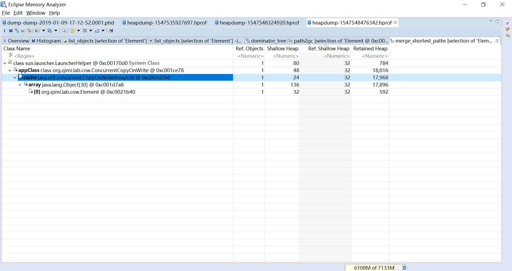
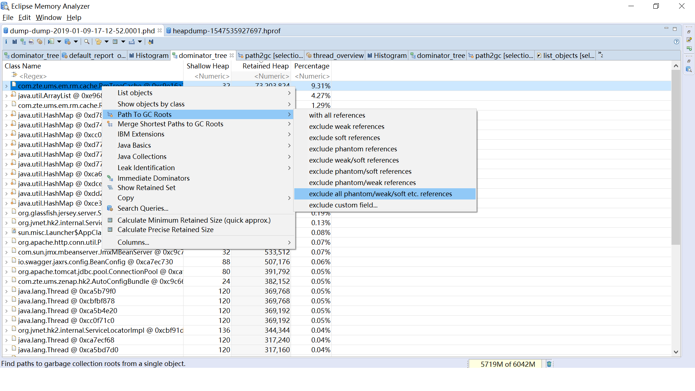

## 对象可达最短路径(Merge Shortest Paths to GC Roots)

该功能既可以作用在对象上，也可以作用在类上，找到从GC Root到当前选择的，或者当前查询对象的最短路径

如下图，根节点是GC Root，每个GC Root都会显示类型，例如System Class、Thread等，一直显示到当前选择节点

一般来讲可以选择exclude all plantom/weak/soft etc. references。
这样就排除了虚引用、弱引用、以及软引用，剩下的就是强引用

还不太清楚Merge Shortest Paths to GC Roots这个功能的使用场景