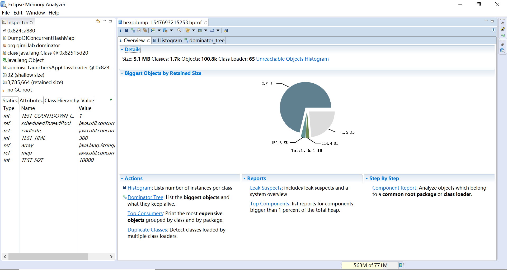

## Overview(概览)

* Details 显示了一些统计信息，包括整个堆内存的大小、类（Class）的数量、对象（Object）的数量、类加载器（Class Loader)的数量
* Biggest Objects by Retained Size 使用饼图的方式直观地显示了堆内存中最大的几个对象，
当光标移到饼图上的时候会在左边Inspector和Attributes窗口中显示详细的信息。
* Actions 功能的快捷方式，包括直方图(Histogram)、支配树(Dominator Tree)、最大内存消耗者(Top Consumers)、重复类(Duplicate Classes)
* Reports 报告的快捷方式，包括内存泄露诊断(Leak Suspects)和最高消费组件(Top Components)
* Step By Step 以向导的方式引导使用功能