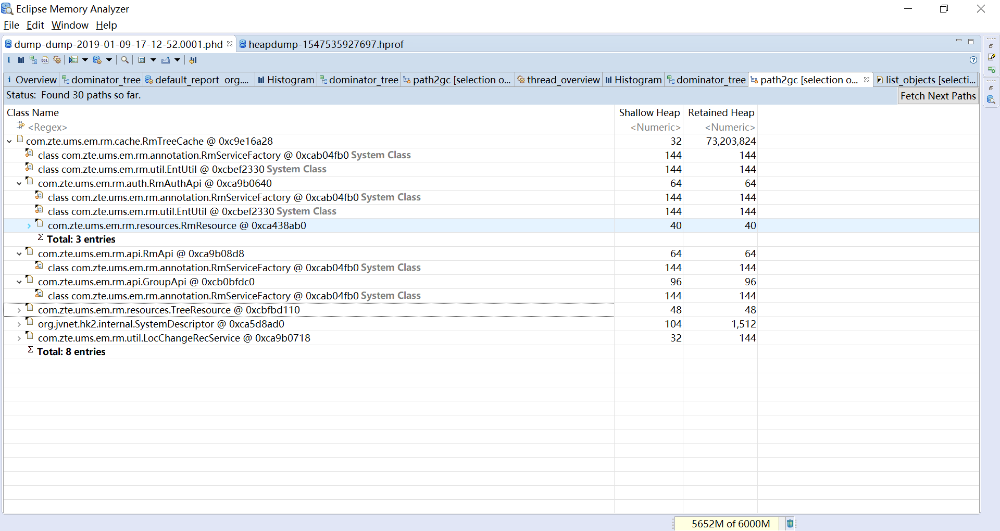
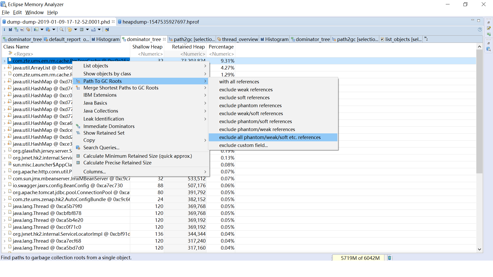

## Path to GC Roots

作用在对象上的功能，描述从一个对象到GC Root的引用链，称为Path to GC Roots

如下图，根节点是当前选择的，或者当前查询的对象，叶子节点都是GC Root，每个GC Root都会显示类型，例如System Class、Thread等

一般来讲可以选择exclude all plantom/weak/soft etc. references。
这样就排除了虚引用、弱引用、以及软引用，剩下的就是强引用

从GC Root到对象的强引用，是对象不被回收的根本原因，可以通过此观察一些你认为应该回收的对象，为什么未被回收

建议通过多次堆转储，找到长时间不回收的对象，观察Path to GC Roots