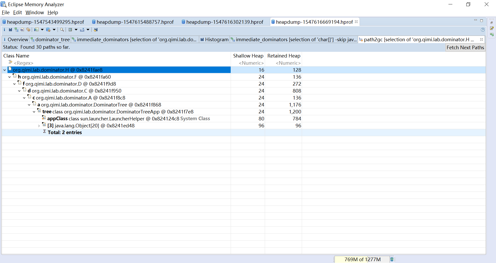
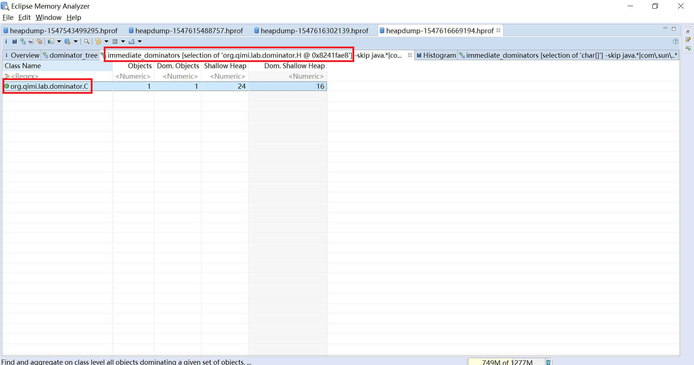
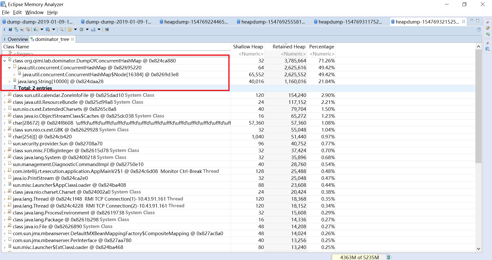

* [安装DTFJ插件](./Installing%20IBM%20DTFJ%20feature/README.md)

* [概览(Overview)](./Overview/README.md)

* [直方图(Histrogram)](./Histrogram/README.md)

* [支配树(Dominator Tree)](./Dominator%20Tree/README.md)

* [线程分析(Analyzing Threads)](./Analyzing%20Threads/README.md)

* [类加载器分析(Analyze Class Loader)](./Analyze%20Class%20Loader/README.md)

* [比较池(Compare Basket)](./Compare%20Basket/README.md)

* [直接支配者(Immediate Dominators)](./Immediate%20Dominators/README.md)

* [支配树上的重枝(Big Drops in Dominator Tree)](./Big%20Drops%20in%20Dominator%20Tree/README.md)

* [对象可达路径(Path to GC Roots)](./Path%20to%20GC%20Roots/README.md)

* [对象可达最短路径(Merge Shortest Paths to GC Roots)/](./Merge%20Shortest%20Paths%20to%20GC%20Roots/README.md)

* [不可达对象(Unreachable)](./Unreachable/README.md)

* [提取列表对象值(Extract List Values)](./Extract%20List%20Values/README.md)

* [最大内存消耗者(Top Consumers)](./Top%20Consumers/README.md)

* [类重复(Duplicate Classes)](./Duplicate%20Classes/README.md)

**所有功能其实就是配置不同的SQL查询语句**

**MAT中大部分功能都是围绕着路径，有的是从支配的角度，有的是从引用的角度**

    [Dominator](https://github.com/wenger66/java-lab/tree/master/dominator) 是一个观察支配树的实验，通过MAT就能观察到
    从基于引用的对象图到基于支配的支配树结构
    

通过MAT的Path to GC Roots和Immediate Dominators这两个功能，就能看到这两种角度
图2是从引用的角度，图3是从支配的角度
 
 

MAT中最常见的对象/类表格的Class Name列的值包含了大量的信息，以实际场景为例

上图中
* cache: 变量名称，这个变量是一个CopyOnWriteArrayList的对象，参考代码段1
* array: 变量名称，CopyOnWriteArrayList的对象中的一个属性是array，这个变量是一个Object数组，参考代码段2
* \[0\]: 数组Index，这个对象是Object数组的第0个元素
* org.qimi.lab.cow.Element @ 0xc0021b40: 对象类和对象地址

对应如下的代码

        // 测试对象缓存列表
        private static List<Element> cache = new CopyOnWriteArrayList<Element>();
        
        /** The array, accessed only via getArray/setArray. */
        private transient volatile Object[] array;
        

上图中
* java.lang.String[10000]: 10000是数组的元素个数
* java.util.concurrent.ConcurrentHashMap$Node[16384]: 16384是HashMap中的水桶数，即HashMap的容量
HashMap的容量、负载因子和元素数量有下面的一个关系
例如本例中负载因子是0.75，容量是16384，元素数量是10000

     负载因子 * 容量 > 元素数量
    

