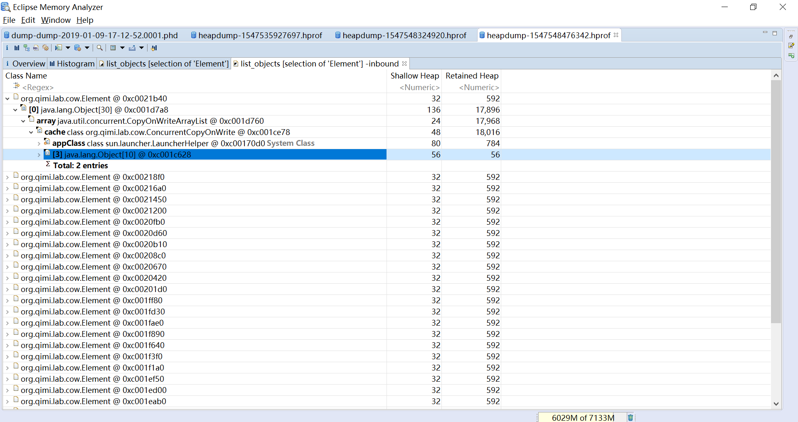

* [安装DTFJ插件](./Installing%20IBM%20DTFJ%20feature/README.md)

* [直方图(Histrogram)](./Histrogram/README.md)

* [线程分析(Analyzing Threads)](./Analyzing%20Threads/README.md)

* [对象可达路径(Path to GC Roots)](./Path%20to%20GC%20Roots/README.md)

* [对象可达最短路径(Merge Shortest Paths to GC Roots)/](./Merge%20Shortest%20Paths%20to%20GC%20Roots/README.md)

* [提取列表对象值(Extract List Values)](./Extract%20List%20Values/README.md)

* [不可达对象(Unreachable)](./Unreachable/README.md)

所有功能其实就是配置不同的SQL查询语句

最常见的对象/类表格的名称列(Class Name)包含了大量的信息，以下图为例，与下面的代码是对应的。

* cache: 变量名称，这个变量是一个CopyOnWriteArrayList的对象，参考代码段1
* array: 变量名称，CopyOnWriteArrayList的对象中的一个属性是array，这个变量是一个Object数组，参考代码段2
* \[0\]: 数组Index，这个对象是Object数组的第0个元素
* org.qimi.lab.cow.Element @ 0xc0021b40: 对象类和对象地址
===================================================================================

        // 测试对象缓存列表
        private static List<Element> cache = new CopyOnWriteArrayList<Element>();
        
        /** The array, accessed only via getArray/setArray. */
        private transient volatile Object[] array;

