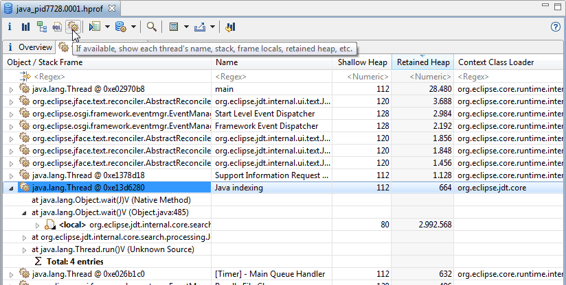
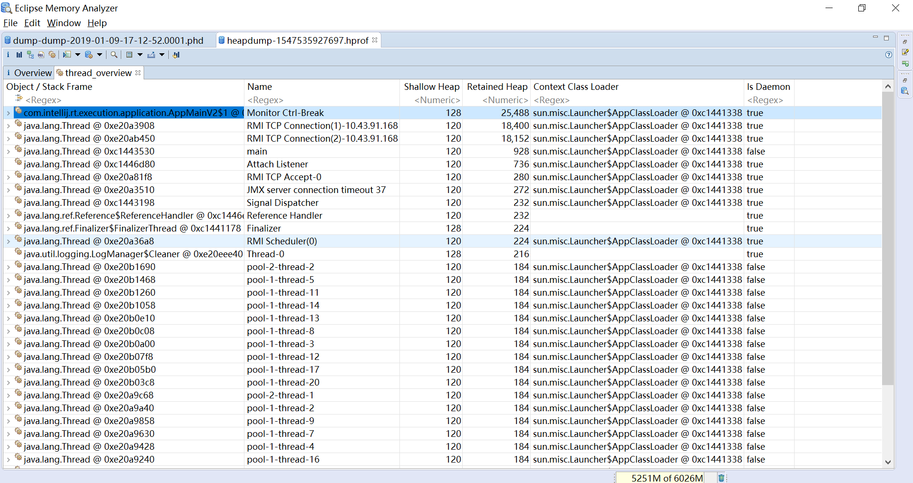
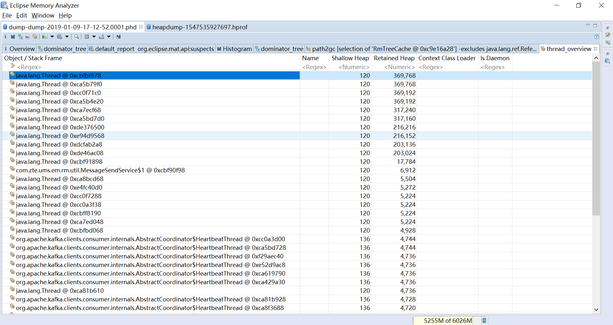

## 线程分析

### 线程概览

两种方式可以打开线程概览，一种是按下图点击工具栏按钮，一种是通过Open Query Browser > Java Basics > Thread Overview and Stacks ，不输入
对象就会显示全部线程。
第二种方式可以理解为一种预定义查询。

一些堆转储格式，例如HPROF和IBM System dump是包含线程的调用堆栈和每个栈帧的Java本地对象的

下图1是HPROF转储文件的线程页面，下图2是PHD转储文件的线程页面，可以看出PHD格式的转储有较大缺失

线程概览表格包括以下列：
* 对象或栈帧(Object / Stack Frame)：格式是类@地址，例如com.intellij.rt.execution.application.AppMainV2$1@0xc1444d88，可以展开栈帧
* 名称(Name)：线程名称
* 浅堆(Shallow Heap)：对象本身占用的内存空间，单位是字节
* 保留堆(Retained Heap)：回收对象后可以回收的内存空间，单位是字节
* 类加载器(Context Class Loader)：ClassLoader的类@地址
* 是否是守护线程(Is Daemon)：  是否是守护线程
可以通过排序Retained Heap列，找到占用内存最多的线程

线程概览可以观察线程的调用栈和本地Java对象，所以转储文件和MAT不仅仅可以用来定位内存相关的问题，还可以在其他问题上派上用场，例如应用没有反应。
