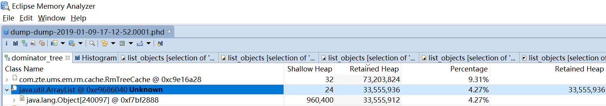

# 基本概念

## 堆转储

堆转储是Java进程在某个特定时间的内存快照。根据包含的信息不同，有很多种格式，但是基本上都会包括Java对象、Java类的信息。
正常情况下，在堆转储之前会触发一次Full GC。

Memory Analyzer工具内能使用HPROF二进制堆转储文件，OpenJ9的系统转储文件，OpenJ9的PHD堆转储文件。

堆转储信息中通常包括：

* 所有对象，包括对象的类、属性、值、引用
* 所有类，包括类的类加载器、名称、父类、静态属性
* GCRoots，虚拟机可达的对象
* 线程堆栈和本地变量，快照时的线程调用栈，每个栈帧本地对象的信息

堆转储并不包含所有信息，例如对象的创建者和创建位置。

## 浅堆(Shallow heap) vs 保留堆(Retained heap)

浅堆(Shallow heap)：指一个对象本身占用的内存，包括每个引用占用32位或者64位（根据操作系统架构的不同）的内存，每个整型占用4个字节的内存，
每个长整型占用8个字节的内存等等

保留集合(Retained set):当对象X被回收时，所有可以被回收的对象，一起组成了X的Retained set

保留堆(Retained heap):对象X的保留集合中的所有对象的本身大小总和，就是X的保留堆大小。也可以这样理解：为对象X保留的堆空间

简而言之，一个对象的浅堆指的是本身占用的堆内存空间，一个对象的保留堆指的是当这个对象被回收后，所有可以连带被回收对象总共占用的堆内存空间

领头集合的保留集合（The retained set for a leading set ）：领头集合的所有对象都被回收时，保留集合的所有对象将被释放。

这个概念主要用来针对被多个引用的对象。如下图，只有G被回收，H由于仍被F引用，并不属于G的保留集合;
同理，只有F被回收，H由于仍被G引用，也不属于F的保留集合。所以只有G、F都被回收，H才可以被回收，所以G、F就称为
领头集合，这个领头集合的保留集合就包含了H

最小保留堆大小(The Minimum Retained Size): 是一种对于保留堆大小的估计值，这种算法比精确求出保留堆大小快很多，它只依赖检查集合？中对象的数量，
并不考虑堆转储中对象的数量。

## 支配树([Dominator Tree](https://help.eclipse.org/2018-12/index.jsp?topic=/org.eclipse.mat.ui.help/welcome.html))

Memory Analyzer工具可以将对象图转换为一种支配树结构。
这种转换让定位对象保留的最大内存块和对象间的依赖关系比较容易。下面是一些非正式术语定义

对象X支配对象Y，含义是每个从开始(或跟)节点到达Y的对象路径总会经过X

对象X直接支配对象Y，含义是X是距离对象Y最近的支配者

支配树是独立于对象图外构建的，在支配树上的每个对象都是其孩子节点的直接支配者，因此定位对象间的依赖关系比较容易

对象支配树有下面几个重要的特点：
* 对象X子树的对象就是对象X的保留集合(Retained set)
* 如果对象X直接支配对象Y，那么直接支配对象X的对象也支配对象Y，依此类推
* ？支配树中的边缘不直接对应于对象图的对象引用

以下图为例，左边是对象图结构，右边是支配树结构。虽然G和F是H的直接引用者，但是C才是引用H总会经过的对象，也是最近的对象，因此C是H的
支配者，而且是直接支配者。

## [GC Roots](https://help.eclipse.org/2018-12/index.jsp?topic=/org.eclipse.mat.ui.help/welcome.html)

垃圾收集的根指的是可以从堆中直接访问的对象，一个对象成为GC Root有以下的原因：
* System Class，系统类加载器和启动类加载器加载的类，例如rt.jar中的一切
* JNI Local，本地代码的本地变量，例如用户定义的JNI代码或者JVM内部代码
* JNI Global，本地代码的全局变量，例如用户定义的JNI代码或者JVM内部代码
* Thread Block，活动的线程引用的对象
* Thread，已启动未停止的线程
* Busy Monitor，调用wait()或notify()或同步的对象。例如调用synchronized(Object) 或者进入一个同步方法。
* Java Local，本地变量。For example, input parameters or locally created objects of methods that are 
                  still in the stack of a thread.
* Native Stack，本地栈。In or out parameters in native code, such as user defined JNI code or JVM internal code. 
                   This is often the case as many methods have native parts and the objects handled as method 
                   parameters become GC roots. For example, parameters used for file/network I/O methods or reflection.
* Finalizable，在队列上等待运行finalizer的对象
* Unfinalized，有finalize方法的对象，但是还没有销毁，并且还没有放到销毁队列上。
* Java Stack Frame，A Java stack frame, holding local variables. Only generated when the dump is parsed with the preference set to treat Java stack frames as objects.
* Unknown，不知道根类型的一种对象，这种类型可以确保MAT不遗漏的显示堆中的所有对象。以IBM的便携堆转储(phd)为例，MAT解析这类转储文件时，把那些其他
根无法到达的，非传入引用的对象都认为是GC Root，类型是Unknown
会将

为什么要列出这些GC Roots类型，如下图，对象旁边标记的Unknown，首先表明这个对象是GC Root，其次Unknown说明了这个GC Root的类型

## 传出引用(Outgoing References) vs 传入引用(Incoming References)

传出引用, 对象X的传出引用是对象X的实际内容，即对象X引用的外部对象

传入引用, 由于这类引用的存在，对象X占用的内存空间无法被回收
